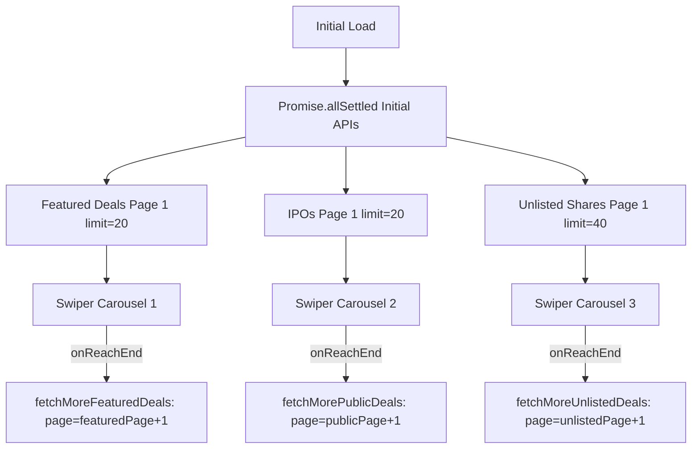

# API & Pagination Architecture Documentation

This document outlines the API endpoints, query parameters, data flow, and pagination mechanics used in the **All Deals** page and the **Deal Showcase** component.

---

## 1. All Deals Page (`/deals` & `/deals/[slug]`)

### 1.1 Files Involved
- [AllDeals.jsx](file:///Users/amansingh/Desktop/webninjaz%20projects/preqt-user-main/pre-equity/src/app/deals/components/AllDeals/AllDeals.jsx) *(Main client listing and infinite scroll)*
- [deals/page.jsx](file:///Users/amansingh/Desktop/webninjaz%20projects/preqt-user-main/pre-equity/src/app/deals/page.jsx) *(SSR route for `/deals`)*
- [deals/[slug]/page.js](file:///Users/amansingh/Desktop/webninjaz%20projects/preqt-user-main/pre-equity/src/app/deals/[slug]/page.js) *(SSR route for dynamic categories & detail views)*

---

### 1.2 API Endpoints & Query Parameters

#### A. Initial SSR Data Fetching
| Route / Category | Method | Endpoint & Parameters | Limit |
| :--- | :--- | :--- | :--- |
| **All Deals (`/deals`)** | `GET` | `admin/api/deals/all-deals/?limit=40&page=1&deal_type=[unlisted,public]` | 40 |
| **Unlisted (`/deals/unlisted-shares`)** | `GET` | `admin/api/deals/all-deals/?limit=40&page=1&deal_type=unlisted` | 40 |
| **Upcoming IPO (`/deals/upcoming-ipo`)** | `GET` | `admin/api/deals/all-deals/?limit=20&page=1&deal_type=public` | 20 |
| **IPO (`/deals/ipo`)** | `GET` | `admin/api/deals/all-deals/?limit=20&page=1&deal_type=public` | 20 |

#### B. Client-Side Infinite Scroll & Tab Switching (`AllDeals.jsx`)
- **Base Endpoint**:
  ```http
  GET /admin/api/deals/all-deals/?limit=40&page=${page}${dealTypeQuery}
  ```
- **Query Parameter Mapping**:
  | Selected Tab | Query Parameter Added |
  | :--- | :--- |
  | **ALL** | `&deal_type=[unlisted,public]` |
  | **Unlisted Shares** | `&deal_type=unlisted` |
  | **Upcoming IPO** | `&deal_type=public` |
  | **IPO (Public)** | `&deal_type=public` |

#### C. Lazy-Loaded Q&A / Reply Counts
- **Endpoint**:
  ```http
  GET /admin/api/dashboard/replies-count/${dealId}
  ```
- **Trigger**: Executed dynamically when individual deal card footers enter the viewport (`IntersectionObserver`), preventing massive upfront API calls.

---

### 1.3 Pagination & Infinite Scroll Logic (`AllDeals.jsx`)

1. **State Management**:
   - `currPage`: Tracks current active page index (starts at `1`).
   - `hasMore`: Boolean flag indicating whether additional deals exist.
   - `loading` / `loadMore`: Loading indicators for initial load and bottom pagination.
2. **Sentinel Intersection Observer**:
   - An invisible DOM marker `<div ref={hasMoreRef} />` sits at the bottom of the list.
   - When the user scrolls down and the sentinel enters the viewport (threshold `0.1`):
     - `setCurrPage(prev => prev + 1)` triggers.
     - Fetches `page = currPage + 1` with `limit=40` and active `deal_type`.
     - Appends new items to `allDeals`: `setAllDeals(prev => [...prev, ...newDeals])`.
3. **`hasMore` Calculation**:
   ```javascript
   const loadedCount = (page - 1) * 40 + deals.length;
   const totalRecords = Number(pagination.totalRecords || pagination.total || 0);
   setHasMore(totalRecords > 0 ? totalRecords > loadedCount : deals.length >= 40);
   ```
4. **Category / Tab Change Handling**:
   - When switching tabs (e.g., from `ALL` to `Unlisted`):
     - Resets `currPage = 1`.
     - Sets `loading = true`.
     - Fetches page 1 with the new `deal_type`.
     - Replaces existing deal list with new data.

---

## 2. Deal Showcase Page (`DealShowcase.jsx`)

### 2.1 File Involved
- [DealShowcase.jsx](file:///Users/amansingh/Desktop/webninjaz%20projects/preqt-user-main/pre-equity/src/app/components/home/DealShowcase/DealShowcase.jsx) *(Landing page showcase with 3 Swiper sliders)*

---

### 2.2 Sections & API Endpoints

The showcase renders 3 independent sections, each hitting its dedicated API endpoint directly without client-side cross-filtering:

| Section | Method | Endpoint & Parameters | Limit |
| :--- | :--- | :--- | :--- |
| **⭐ Featured Deals** | `GET` | `admin/api/deals/all-deals/?deal_type=[unlisted,public]&deal_sub_type=featured&limit=20&page=${featuredPage}` | 20 |
| **🚀 IPOs** | `GET` | `admin/api/deals/all-deals/?limit=20&page=${publicPage}&deal_type=public` | 20 |
| **💼 Unlisted Shares** | `GET` | `admin/api/deals/all-deals/?limit=40&page=${unlistedPage}&deal_type=unlisted` | 40 |

---

### 2.3 Pagination Logic (`DealShowcase.jsx`)

Each section operates on an independent Swiper carousel with its own dedicated pagination state and load-more callback:



#### Dedicated Pagination States:
- **Featured Deals**: `featuredPage`, `hasMoreFeatured`, `loadingMoreFeatured`, `fetchMoreFeaturedDeals()`
- **IPOs (Public)**: `publicPage`, `hasMorePublic`, `loadingMorePublic`, `fetchMorePublicDeals()`
- **Unlisted Shares**: `unlistedPage`, `hasMoreUnlisted`, `loadingMoreUnlisted`, `fetchMoreUnlistedDeals()`

#### Swiper End Trigger (`onSlideChange` / `onReachEnd`):
- When a user swipes near the end of any slider (last 3 cards or end), the respective `onReachEnd` handler executes.
- Fetches `nextPage = page + 1`.
- Deduplicates and appends newly received cards to the respective section state:
  ```javascript
  setIpoDeals((prev) => {
      const existingIds = new Set(prev.map((d) => d.id));
      const uniqueNew = newDeals.filter((d) => !existingIds.has(d.id));
      return [...prev, ...uniqueNew];
  });
  ```
- Evaluates `hasMore` and terminates further pagination when all records for that category have been loaded.
